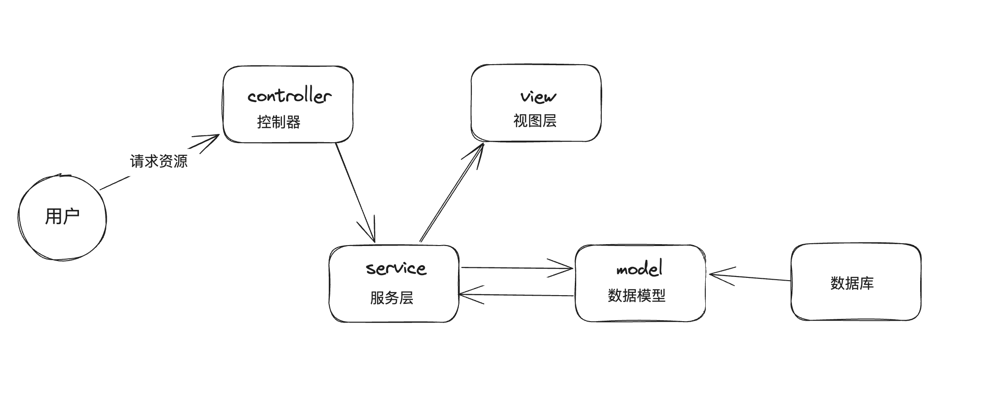

# vue 面试题

## 1. 谈谈对 vue 的理解？

vue 是一个构建用户界面的`渐进式`的 javascript 框架

### 1.1 声明式框架

vue 的核心特点是声明式的、组件化。那我们就有必要知道 `声明式` 和 `命令式` 的区别

- 早期的 `jquery` 就是命令式的，dom 操作都要自己去写，`关注的是过程`
- 声明式框架更加`关注结果`。dom 的操作，命令式的代码都封装到了 `vue` 中
  > 声明式代码更加简单，不需要关注实现，按照规定的写法写就能实现相应的效果

### 1.2 MVVM 模式

说起 MVVM 那就不得不想起 MVC。



- MVC 模式

- MVVM 模式: 数据变了更新视图，视图变了更新数据

> vue 并没有完全遵循 MVVM 模型，但是 Vue 的设计受到了它的启发

### 1.3 虚拟 DOM

传统的更新页面，某个地方发生变化了之后页面要全部渲染，比较浪费性能。还要写命令式的代码去更新

虚拟 DOM 有什么优势：

- 1. 跨平台
- 2. 可以缓存

### 1.4 区分编译时(打包)和运行时(浏览器)

- Vue 渲染就是调用 `render` 方法将`虚拟 DOM` 变成`真实 DOM`
- 专门写个编译时可以将模版编译成虚拟 DOM(在构建(也就是打包的时候)进行编译，不需要在运行的时候在编译)

### 1.5 组件化

实现高内聚、低耦合

- 组件化开发能`提高开发效率`、提高`复用性`
- `降低更新范围`，因为合理的拆分组件，当数据变化了更新的范围更小，只更新变了的部分

## 2 谈谈对 SPA 的理解

### 2.1 基本概念

- **SPA(single-page application)** 单页应用，默认情况下 `Vue`,`React` 都只有一个`html`页面,并且提供一个挂载点，最终打包后在在此页面引入对应的资源。(页面的渲染全部由 js 动态渲染)。切换页面时，通过监听路由的变化，渲染对应页面

- **MPA(Multi-page application)** 多页面应用，多个`html`页面。每个页面重复加载，`js`,`css` 等相关资源。(服务端返回完整的 `html`,同时数据也可以在后端进行获取一并返回`模版引擎`). 多页应用跳转需要整页资源刷新。

### 2.2 优缺点

|                  | 单页面应用(SPA)    | 多页面应用(MPA)                  |
| ---------------- | ------------------ | -------------------------------- |
| 组成             | 一个页面和页面组件 | 多个完整页面                     |
| 刷新方式         | 局部刷新           | 整页刷新                         |
| SEO 搜索引擎优化 | 无法实现           | 容易实现                         |
| 页面切换         | 速度快、用户体验好 | 切换加载资源，速度慢、用户体验差 |
| 维护成本         | 相对容易           | 相对复杂                         |

- 用户体验好、快、内容改变不需要重新加载整个页面，服务端压力小
- SPA 不利于搜索引擎抓取
- 首次渲染速度相对较慢(第一次返回空的 html,需要再次请求首屏数据) 白屏时间长

### 2.3 解决方案

- **静态页面预渲染(Static Site Generation)SSG**, 在构建时生成完整的 html 页面。(就是在打包的时候，先将页面放到浏览器运行一下，将`html`保存起来)，仅适合静态页面网站。变化率不高的网站

- `SSR` + `CSR` 的方式，首屏采用服务端渲染的方式，后续交互采用用客户端渲染方式

## 3. Vue 为什么需要虚拟 DOM？

## 4. 谈一谈对 Vue 组件化的理解

> `WebComponent` 组件化的核心组成：模版、属性、事件、插槽、声明周期

组件化的好处：高内聚、低耦合、可组合

- 组件化开发能大幅度的提高应用的开发效率、测试性、复用性
- 降低更新范围，只重新渲染变化的组件

补充：

- Vue 中每个组件都有一个渲染函数 watcher effect
- 数据时是响应式的，数据变化后会执行 watcher 或者是 effect
- 组件需要合理划分，如果不拆分组件，那更新的时候整个页面都要重新更新
- 如果过分拆分组件的话，会导致 watcher、effect 产生过多，也会造成性能影响

## 5. 既然 Vue 通过数据劫持可以精准的探测数据变化，为什么还需要虚拟 DOM 进行 diff 检测差异？

- `Vue` 的数据劫持是通过 `Object.defineProperty` 或者是 `Proxy` 实现的
- 虚拟 `DOM` 是用于比较两次渲染之间的虚拟树，找出差异并仅更新必要的部分。从而提高性能，减少实际操作 `dom` 的次数 (直接操作真实 `DOM` 代价是非常昂贵的)

## 6. 请说一下你对响应式数据的理解

### 6.1 如何实现响应式数据

数组和对象类型当值发生变化时是如何劫持到的。对象内部是通过`defineReactive`方法，使用`Object.defineProperty`将属性进行劫持(只会劫持已经存在的属性)，数组则是通过重写数组的方法来实现的。多层对象是通过递归来实现劫持的。`vue3`则采用 proxy.

### 6.2 vue2 处理缺陷

- 在`vue2`的时候使用`defineProperty`来进行数据的劫持，需要对属性进行重写添加`getter`及`setter`性能差

- 当新增属性和删除属性时无法监控变化。需要通过`$set`, `$delete`实现
- 数组不采用`defineProperty`来进行劫持 (浪费性能，对所有索引进行劫持会造成性能浪费) 需要对数组单独进行处理
- 对于`ES6` 中新的`Map`、`Set`这些数据结构不支持

### 6.3 Vue2 与 Vue3 实现对比

proxy 劫持的是对象本身，可以直接劫持数组

```js
// vue2
function defineReactive(obj, key, value) {
  observer(value);
  Object.defineProperty(obj, key, {
    get() {
      return value;
    },
    set(newVal) {
      if (newVal !== value) {
        obj[key] = newVal;
        observer(newVal);
      }
    },
  });
}

function observer(data) {
  if (typeof data !== "object") {
    return;
  }
  for (let key in data) {
    defineReactive(data, key, data[key]);
  }
  return data;
}

const o = observer({ name: "1234", age: 2323, op: { a: 1 } });
console.log(o);

//vue3
const handler = {
  get(target, key, receiver) {
    if (typeof target[key] === "object") {
      return new Proxy(target[key], handler);
    }
    return Reflect.get(target, key);
  },
  set(target, key, value) {
    if (target[key] !== value) {
      return Reflect.set(target, key, value, receiver);
    }
    return true;
  },
};

let proxy = new Proxy({ name: 1212 }, handler);
```

## 7. Vue 中如何检测数组的变化

### 7.1 vue2 通过重写数组中的方法来实现的

- 数组考虑性能原因没有用`defineProperty`对数组的每一项进行拦截，而是选择重写数组(`push,pop,shift,unshift,splice,sort,reverse`)方法。数组中有对象方法也会进行递归劫持。

### 7.2 vue3 中直接采用的是 Proxy

- 在 `vue3` 中，直接采用 `Proxy` 实现了更高效和精确的数组变化监测，通过 `Proxy`，`Vue `可以捕获到数组索引和长度的变化，不再需要重写数组的方法。这是 `Vue3` 在性能方面的一个重要改进(但是由于代理的问题，还需要对部分检测方法进行重写)

## 8. 如何将 template 转换成 render 函数

- 将 template 模版转换成 ast 语法树 -`parse` -> `parseHTML`
- Vue2 对静态语法做静态标记 - `optimize` / Vue3 对 ast 语法进行转化 - `transform`
- 重新生成代码 - `generate` -> `codeGen`

> vue3 中模版转化，做了更多的优化操作。vue2 仅仅是标记了静态节点而已

## 9. Vue 中如何进行依赖收集

**Vue2**

- 每一个属性都有自己的`dep` 属性，存放它所依赖的 watcher,当属性变化了会通知对应的 watcher 更新
- 初始化的时候会调用`render`函数，此时会触发属性依赖收集 `dep.depend`
- 当属性发生变化时会触发属性所依赖的`watcher`更新`dep.notify()`

**Vue3**

- `Map -> key -> new Set([])` 这种结构存放`effect`映射起来
- 初始化的时候调用 render 函数，此时会调用`track`方法进行依赖收集
- 当属性发生修改时会找对应的`effect`列表，执行`run`方法

## 10. Vue 中的 diff 算法原理 (重要 -> 重新总结)

### 10.1 概念

vue 是基于虚拟 `DOM` 来更新真实 `DOM` 的。`diff` 就是比较两个虚拟 `DOM` 的差异。然后将差异的部分更新到真实 `DOM` 中去。采用`平级比较`，`深度递归` 和 `双指针`的方式进行比较

### 10.2 Vue2 diff 流程

- 先比较是不是拥有相同的 `tag` 和 `key`
- 相同节点比较属性，并复用老节点
- 比较儿子节点，考虑节点和新节点儿子的情况
  - 老的没儿子，新的有儿子，直接插入新儿子
  - 老的有儿子，新的没儿子，直接删除老儿子
  - 老的儿子是文本，新的儿子也是文本，直接更新文本节点
  - 老的儿子和新的儿子都是列表，走 updateChildren 方法
- 头头、尾尾、头尾、尾头
- 比对查找进行复用

## 11. key 的作用和原理

- `Vue` 在 `patch` 的过程中通过 `key` 可以判断两个虚拟节点是否是相同节点。是的话可以复用
- 没有 `key` 或者用 `index` 作为 `key`，会导致更新出问题
- 尽量不要用索引作为 `key`

## 12. 谈谈 Vue3 中模版编译做了哪些优化(待处理)？

### 12.1 PatchFlags 优化

`diff` 算法无法避免新旧虚拟 DOM 中无用的比较操作，通过 `patchFlags` 来标记动态内容，可以实现快速 `diff` 算法

```html
<div>
  <h1>hello</h1>
  <span>{{name}}</span>
</div>
```

## 13. Vue3 和 Vue2 对比的变化

- 性能优化(更快)

  - 使用了 `Proxy` 替代了 `Object.defineProperty` 实现响应式。(`defineProperty` 需要对属性进行递归重写添加 getter 和 setter 性能差，同时新增属性和删除属性时无法监控变化，需要`$set，$delete` 方法。此方法对数组劫持性能差，同时不支持 `map` 和 `set` 这种数据结构)
  - 模版编译优化。给动态节点增加 `PatchFlag` 标记：对静态节点进行静态提升；对事件进行缓存处理
  - `diff` 算法优化。全浪 diff 算法采用最长递增子序列减少节点的移动。在非全量 `diff` 算法中只比较动态节点，通过 `PatchFlag` 标记更新动态的部分

- 体积优化(更小)

  - Vue3 移除了不常用的 API
    - 移除 `inline-template` (Vue2 中就不推荐使用)
    - `$on、$off、$once`(可以使用 mitt 库来实现)
    - 删除过滤器(通过计算属性或者方法来实现)
    - $children移除(可以通过`provide`、`inject`方法构建`$children`)
    - 移除`.sync、.native` 修饰符(`.sync` 通过 `v-model:xxx` 实现，`.native` 为 `vue3` 的默认行为)以及不再支持 `keycode` 作为 `v-on` 修饰符
    - 移除全局 API。`Vue.component` `Vue.use` `Vue.directive`(将这些 API 挂载到实例上)
  - 通过构建工具 `Tree-shaking` 机制实现按需引入，减少用户打包体积

- 支持自定义渲染器

  - 用户可以自定义渲染 API 达到跨平台的目的。扩展能力强，无需改造 Vue 源码

- Typescript 支持

  - `Vue3` 源码采用 `Typescript` 来进行重写，对 `Ts` 支持的更加友好

- 源码结构变化
  - `Vue3` 源码结构采用 `monorepo` 方式进行管理，将模块拆分到 `package` 目录中，解耦后可单独使用

## 14. 如何看待 Composition API 和 Options API?

- Vue2 中采用的时 `Options Api`，所有的 `data,props,methods,computed,watch` 等属性(用户编写复杂业务逻辑会出现反复横跳的问题)
- Vue2 中所有的属性都是通过 `this` 访问的，`this` 存在指向性问题
- vue2 中很多未使用的方法和属性依旧会打包，并且所有全局 API 都在 `Vue` 对象上公开。`Composition API` 对 `tree-shaking` 更加友好，代码更容易压缩
- 组件逻辑共享问题。`vue2` 采用了 `mixins` 实现组件间的逻辑共享，但是会有数据来源不明确，明明冲突等问题。`Vue3 `采用了 `CompositionApi` 提取公共逻辑比较方便

## 15. Vue 中的 v-show 和 v-if 怎么理解？

### 15.1 基本概念

- **v-if**: 如果条件不成立就不会渲染当前指令所在节点的 `dom` 元素
- **v-show**: 只是切换当前 `dom` 的显示或者隐藏 `display` `opacity` `visibility`

### 15.2 如何选择

- `v-if` 可以阻断内部代码是否执行，如果条件不成立不会执行内部逻辑
- 如果页面逻辑在第一次加载的时候已经被确认后续不会平凡更改则采用 `v-if`

## 16.v-if 和 v-for 那个优先级更高？

- vue2 和 vue3 中都不建议 v-if 和 v-for 连用

- 在 `vue2` 中解析时，先解析 `v-for` 再解析 `v-if`。会导致先循环后再对每一项进行判断，浪费性能
- 在 `vue3` 中 `v-if` 的优先级高于 `v-for`

<div
  style={{
    padding: "1rem",
    backgroundColor: "#fbefff",
    border: "1px solid #8250df",
    borderRadius: "9px",
  }}
>
  <div>在 vue2 和 vue3 中都不建议v-if和v-for连用。</div> 
  <div>如果想要实现v-if 和v-for
  在同一级的效果，先判断再循环，如果条件是数组中的元素的话可以
  需要借助计算属性先去对遍历的数组进行操作.</div>
</div>

## 17.v-once 的使用场景有哪些？

### 17.1 v-once 概念

v-once 是 Vue 中的内置指令，只渲染元素和组件一次。随后重新渲染，元素/组件及其所有的字节点将被视为静态内容并跳过。这可以用于优化更新性能

## 18.Vue 的生命周期方法有哪些？一般在哪一步发送请求及原因

### 18.1 vue2 中的声明周期

- **beforeCreate**: 实例初始化
- **created**: 实例创建完成
- **beforeMount**: 挂载之前被调用
- **mounted**: 实例被挂载之后被调用
- **beforeUpdate**: 在数据发生改变之后，DOM 更新之前调用
- **updated**: 数据更改导致虚拟 DOM 重新渲染和更新完毕之后被调用
- **beforeDestroy**: 实例销毁之前调用
- **destroyed**: 实例销毁之后调用

### 18.2 vue2 和 vue3 中的声明周期对比

| vue2          | vue3            | 描述                            |
| ------------- | --------------- | ------------------------------- |
| beforeCreate  | beforeCreate    | 组件实例被创建之初              |
| created       | created         | 组件实例完全创建                |
| beforeMount   | beforeMount     | 组件挂载之前                    |
| mounted       | mounted         | 组件实例挂载之后                |
| beforeUpdate  | beforeUpdate    | 组件数据发生变化，更新之前      |
| updated       | updated         | 组件更新之后                    |
| beforeDestroy | `beforeUnmount` | 组件销毁之前                    |
| destroyed     | `unmounted`     | 组件销毁之后                    |
| activated     | activated       | keep-alive 缓存组件激活的时候   |
| deactivated   | deactivated     | keep-alive 缓存组件停用时候调用 |
| errorCaptured | errorCaptured   | 捕获子孙错误的时候调用          |

:::tip
上面罗列的都是选项式 api,vue3 新增了组合式 API，生命周期钩子：不存在 onBeforeCreate 和 onCreated，因为在 setup 中实例已经创建好了，剩下的生命周期在原来生命周期的前面加上 on 就行了
:::

:::tip
vue3 中在 onMounted 中发送请求
:::

## 19. Vue.mixin 的使用场景和原理

mixin 可以用来扩展组件，将公共逻辑进行抽离。在需要该逻辑的时候混入，采用策略模式针对不同的属性进行合并。如果混入的数据和本身组件中的数据冲突，会采用就近原则以组建的数据为准

> mixin 中有很多缺陷 明明冲突问题 数据来源问题 Vue 采用 CompositionAPI 提取公共逻辑比较方便

**mixin 在 Vue3 支持主要是为了向后兼容，因为生态中有许多库使用到，在新的应用中应尽量避免使用 mixin 特别是全局 mixin**

## 20. Vue.use 是干什么的？

### 20.1 use 概念

安装 Vue 插件。如果一个插件是一个对象，必须提供 install 方法。如果一个插件是一个函数，它会被作为 install 方法。install 方法调用时，会将 Vue 作为参数传入，这样插件中就不在需要依赖 Vue 了

### 20.2 插件功能

- 添加全局指令、全局过滤器（vue3 不支持）、全局组件
- 全局混入添加组件选项
- 添加实例方法，通过把他们添加到`Vue.prototype`/`app.config.globalProperties`上实现

## 21.说一说你对双向绑定(v-model)的理解，以及它的实现原理

### 21.1 概念

vue 中双向绑定是靠 v-model 这个指令，将一个动态的值绑定到视图上，修改视图能改变数据，修改数据能改变视图。

### 21.2 表单元素中的 v-model

内部会根据标签的不同解析出不同的语法。并且有额外的处理逻辑

- 文本框会被解析成 value + input 事件(同时处理中文的问题)
- 复选框会被解析成 checked + change 事件

### 21.3 组件中的 input 元素

组件上的 `v-model` 默认会利用名为 `value` 的 `prop` 和名为 `input` 的事件。对于组件而言 `v-model` 就是 `value + input` 的语法糖。可用于组件中数据的双线绑定

`vue2` 中只能写一个 `v-model`,`vue3` 中能写多个

`vue3` 中 `v-model` 用法 3.4 之后可以用 defineModel 的写法 用起来简单点

**父组件**

```html
<script setup>
  import { ref } from "vue";
  import HelloWorld from "./components/HelloWorld.vue";

  const count = ref(0);
  const name = ref("");
</script>

<template>
  <HelloWorld v-model:count="count" v-model:name="name" />
  <br />
  <div>Count:{{ count }}</div>
  <div>Name: {{ name }}</div>
</template>
```

**子组件**

```html
<script setup>
  defineProps(["count", "name"]);
  defineEmits(["update:count", "update:name"]);
</script>

<template>
  <div>Child</div>
  Count:
  <input :value="count" @input="$emit('update:count', $event.target.value)" />
  <br />
  Name:
  <input :value="name" @input="$emit('update:name', $event.target.value)" />
</template>
```

## 22. Vue.extend 方法的作用？

### 22.1 Vue.extend 概念

使用基础的 `Vue` 构造器，创建一个子类。参数是一个包含组件选项的对象

`data` 选项是特例，需要注意在 `Vue.extend()` 中必须是个函数

### 22.2 vue3 中手动挂载

> vue3 中不再使用 Vue.extend 方法，而是采用 render 方法进行手动渲染

```html
<!DOCTYPE html>
<html lang="en">
  <head>
    <meta charset="UTF-8" />
    <meta name="viewport" content="width=device-width, initial-scale=1.0" />
    <title>Document</title>
  </head>
  <body>
    <div id="app"></div>
    <script type="module">
      import {
        render,
        h,
        ref,
      } from "./vue3/node_modules/vue/dist/vue.esm-browser.js";
      const App = {
        template: `<div id='counter'>{{count}}</div>`,
        setup() {
          const count = ref(0);
          return { count };
        },
      };
      const app = render(h(App), document.getElementById("app"));
    </script>
  </body>
</html>
```

## 23.Vue 组件 data 为什么必须是个函数？

- 根实例对象 data 可以是一个对象也可以是个函数，不会产生数据污染的情况，因为根组件是单例的
- 组件实例队形 `data` 必须是一个函数，目的是为了防止多个组件实例对象之间共用一个 `data`,产生数据污染。所以需要通过工厂函数返回全新的 `data` 作为组件的数据源

> vue3 全是函数了

## 24. Vue.set 方法是如何实现的？

Vue2 不允许在已经创建的实力上动态添加新的响应式属性。所以采用 set API 来进行实现

## 25. Vue 项目中错误是如何处理的？

### 25.1 errorCaptured 钩子

可以捕获一个来自后代组件的错误时被调用，如果全局的 `config.errorHandler` 被定义，所有的错误都会发送给它，因此这些错误都会在一个统一的地方报告。

> 在捕获了后代组件传递的错误时调用。这个钩子可以通过返回 `false` 来阻止错误继续向上传递。如果有多个 `errorCaptured` 钩子，那么依此调用类似冒泡机制。如果本身抛出错误，那么这个错误和原来捕获到的错误都会被发送到`config.errorHandler`

## 26. 如何理解 reactive,ref,toRef 和 toRefs?

- **reactive**: 将一个普通对象转换为响应式对象，采用 new Proxy 来实现，当访问代理对象的属性的时候会进行依赖收集，属性更新是会触发依赖更新

- **ref**: 创建一个包装对象，将一个简单的值包装成响应式对象，当访问 value 属性的时候会进行依赖收集，更新 value 的时候会触发依赖更新。(采用类访问器实现) 内部的对象还是会采用 reactive 来处理

- **toRef**: 创建 ref 对象，引用 reactive 中的属性

- **toRefs**：批量创建 ref 对象，引用 reactive 中的属性

## 27. watch 和 watchEffect 的区别是什么？

- `watchEffect` 立即运行一个函数，同时响应式地追踪其依赖，并在依赖更改时重新执行

- `watch` 侦测一个或多个响应式数据源并在数据发生变化的时候调用一个回调函数

watch,computed,watchEffect/组件渲都是依赖下面这个 effect 实现的

effect 原理

```html
<script type="module">
  import {
    ReactiveEffect,
    reactive,
  } from "./vue3/node_modules/vue/dist/vue.esm-browser.js";
  const state = reactive({ name: "xz" });
  const effect = new ReactiveEffect(
    () => {
      return state.name; // 收集属性
    },
    () => {
      console.log("数据变化");
    }
  );
  effect.run(); // 渲染
  state.name = "32323";
</script>
```

## 28.computed 和 watched 的区别

vue2 中有三种 watcher(渲染 watcher、计算属性 watcher、用户 watcher)
vue3 中有三种 effect(渲染 effect、计算属性 effect、用户 effect)

### 28.1 computed

- 计算属性只有当用户取值的时候才会执行对应的方法
- computed 属性时具备缓存的，依赖的值不发生变化，对其取值时计算属性方法不会重新执行
- 计算属性可以简化模版中的复杂表达式
- 计算属性不支持异步逻辑

### 28.2 watch

watch 支持异步，监控某个值的变化

## 29.说说你对 nextTick 的理解？

> 当你在 Vue 中更改响应式状态时，最终的 DOM 更新并不是同步生效的，而是由 Vue 将他们缓存在一个队列中，直到下一个 tick 才一起执行。这样是为了确保在频繁更新的时候，可以只触发一次

### 29.1 Vue2 中的 nextTick

```html
<script>
  // 打印的是0
  const vm = new Vue({
    el: "#app",
    data() {
      return { count: 0 };
    },
    mounted() {
      // [渲染逻辑，nextTick逻辑，数据更新逻辑]
      this.$nextTick(() => {
        console.log(document.getElementById("app").innerHTML);
      });
      this.count = 100;
    },
  });
</script>
```

> Vue2 nextTick 实现就是优雅降级(Promise, MutationObserver, setImmediate, setTimeout) 这里一般会配合浏览器事件环作为面试题

### 29.2 Vue3 中的 nextTick

```html
<script>
  const App = {
    el: "#app",
    data() {
      return { count: 0 };
    },
    mounted() {
      Vue.nextTick(() => {
        console.log(document.getElementById("app").innerHTML);
      });
      // nextTick永远在更新之后执行 打印的时100不是0
      this.count = 100;
    },
  };
  const app = Vue.createApp(App);
  app.mount("#app");
</script>
```

> Vue 不再考虑 `promise` 的兼容性，所以 `nextTick` 的实现原理就是 `promise.then` 方法

## 30. Vue 中的过滤器了解嘛？ 过滤器的应用场景？

## 31. Vue 中的 slot 是如何实现的？什么时候使用它？

### 31.1 什么是插槽？

利用 `slot` 进行占位，在使用组件的时候，标签内的内容会渲染到对应的 slot 内

### 31.2 什么时候使用它？

### 31.3 插槽的分类和原理

> 具名插槽，作用域插槽

```js
// 父组件
<div>
  <template v-slot:header>12121212</template>
</div>

// 子组件
<div>
  <slot name="header"></slot>
</div>
```

## 32. Vue 中组件的通信方式？

Vue3 通信方式：

- `props` 父子间通信
- `$attrs` 父子间通信
- `$emit` 子父通信
- `expose/ref/$parent` 实例通信
- `v-model` 数据同步
- `provide/inject` 跨级通信
- `slot` `ui` 通信
- `Vuex/pinia` 状态管理
- `mitt` 发布订阅通信

## 33. Vue 中异步组件作用和原理

vue3 异步组件写法

`ES` 模块动态导入返回的是一个 `Promise`，`defineAsyncComponent` 接收一个 `Promise`

```js
import { defineAsyncComponent } from "vue";

const AsyncComp = defineAsyncComponent(() =>
  import("./components/MyComponent.vue")
);
```

也可以写成下面这种可以扩展的方式

```js
const AsyncComp = defineAsyncComponent({
  // 加载函数
  loader: () => import("./Foo.vue"),

  // 加载异步组件时使用的组件
  loadingComponent: LoadingComponent,
  // 展示加载组件前的延迟时间，默认为 200ms
  delay: 200,

  // 加载失败后展示的组件
  errorComponent: ErrorComponent,
  // 如果提供了一个 timeout 时间限制，并超时了
  // 也会显示这里配置的报错组件，默认值是：Infinity
  timeout: 3000,
});
```

## 34.组件写 name 有什么好处？

组件的名字有以下用途：

- 标识组件
- 在组件自己的模板中递归引用自己时
- 在 Vue 开发者工具中的组件树显示时
- 在组件抛出的警告追踪栈信息中显示时

有一种场景下 `name` 必须是已显式声明的：即 `<KeepAlive>` 通过其 `include / exclude prop` 来匹配其需要缓存的组件时。

## 35.keep-alive 平时在哪里使用？

### 35.1 概念

keep-alive 是一个内置组件，它的功能是在多个组件间动态切换时缓存被移除的组件实例

```vue
<template>
  <div>
    <label><input type="radio" :value="Child1" v-model="current" />A</label>
    <label><input type="radio" :value="Child2" v-model="current" />B</label>
    <KeepAlive>
      <component :is="current" />
    </KeepAlive>
  </div>
</template>

<script setup>
import { shallowRef } from "vue";
import Child1 from "./Child1.vue";
import Child2 from "./Child2.vue";
const current = shallowRef(Child1);
</script>
```

在路由中使用 keep-alive

```vue
<template>
  <!-- vue2 -->
  <keep-alive>
    <router-view></router-view>
  </keep-alive>

  <!-- vue3 -->
  <router-view v-slot="Component">
    <keep-alive>
      <component :is="Component" />
    </keep-alive>
  </router-view>
</template>
```

keep-alive 缓存的是组件实例真实 DOM，切换回来并不会触发生命周期钩子，不回去获取最新的数据，这个时候就要借助钩子 onActivated

## 36. 自定义指令的应用场景

### 36.1 指令的概念

除了内置指令，还允许注册自定义指令

### 36.2 指令的声明周期

```js
const myDirective = {
  // 在绑定元素的 attribute 前
  // 或事件监听器应用前调用
  created(el, binding, vnode, prevVnode) {
    // 下面会介绍各个参数的细节
  },
  // 在元素被插入到 DOM 前调用
  beforeMount(el, binding, vnode, prevVnode) {},
  // 在绑定元素的父组件
  // 及他自己的所有子节点都挂载完成后调用
  mounted(el, binding, vnode, prevVnode) {},
  // 绑定元素的父组件更新前调用
  beforeUpdate(el, binding, vnode, prevVnode) {},
  // 在绑定元素的父组件
  // 及他自己的所有子节点都更新后调用
  updated(el, binding, vnode, prevVnode) {},
  // 绑定元素的父组件卸载前调用
  beforeUnmount(el, binding, vnode, prevVnode) {},
  // 绑定元素的父组件卸载后调用
  unmounted(el, binding, vnode, prevVnode) {},
};
```

## 37. Vue 中的修饰符有哪些应用场景？

## 38. 函数组件的优势？

> 函数式组件是一种定义自身没有任何状态的组件的方式。它们很像纯函数：接收 props，返回 vnodes。函数式组件在渲染过程中不会创建组件实例 (也就是说，没有 this)，也不会触发常规的组件生命周期钩子。

在 Vue2 正常组件式通过 Vue.extend 方法进行创建，函数时组件就是普通的函数，没有 new 的过程。最终就是将返回的虚拟 DOM 变成真实 DOM 替换对应的组件，同时函数式组件不会被记录在组件的父子关系中。

**因此在 Vue2 中函数式组件有以下优势**

- 性能优化：函数式组件相对于常规组件在渲染性能上具有优势。由于函数式组件式无状态的，不包含生命周期钩子和实例状态，渲染开销更小

- 没有 this：函数式组件不依赖于 `this`, 不再有 `this` 绑定问题
- 可读性和维护性：函数式组件更加简洁和直观。只是一个函数，没有复杂的选项对象和实例属性。代码更容易维护。
- 容易测试

> 但在 `Vue3` 中因所有的组件都不用 `new` 了，所以在性能上没有了优势，所以不建议使用函数式组件

## 39. Vue 中的性能优化有哪些？

- Vue2 中数据层级不易过深，合理设置响应式数据
- Vue2 非响应式数据可以通过 Object.freeze()方法冻结属性
- Vue 中采用函数式组件
- 使用数据时缓存值的结果，不频繁取值
- 合理设置 key 属性
- v-if 和 v-show 的选取
- 控制组件粒度 -> Vue 采用组件级更新
- 采用异步组件 -> 借助构建工具的分包能力
- 合理使用 keep-alive, v-once, v-memo 进行逻辑优化
- 分页、虚拟滚动、时间分片等

## 40.Vue 项目中是如何跨域的

跨域是浏览器的同源策略导致的，这个事浏览器的行为(协议、域名、端口的不同导致的).服务端和服务端之间进行通信时没有跨域问题的。跨域的实现方案有以下几种

- CORS，由服务端设置，允许制定的客户端访问服务器
- 构建工具中设置反向代码里、使用 Nginx 做反向代理
- 使用 Websocket 进行通信
- 搭建 BFF 层解决跨域问题

## 41. Vue 中封装过 axios 吗？主要是封装哪方面的？

- 请求超时
- 请求路径
- 请求拦截
- 响应拦截
- 请求队列，实现 loading 效果
- 维护取消请求 token，在页面切换时通过导航守卫可以取消上一个页面中正在发送的请求

## 43. Vue 做权限管理该怎么做？控制到按钮级别呢？

- 登录鉴权
- 访问权限。在路由守卫中使用
- 页面权限：前端配置路由分为两个部分 `通用路由配置` 和 `需要权限的路由配置`。在权限路由中增加访问权限 meta(备注)。用户登录后可得到对应的权限列表，通过权限列表筛查出对应符合的路由信息，最后通过 `addRoutes` 方法，动态添加路由
- 按钮权限：一般通过自定义指令来实现

## 44. 单页面应用首屏加载慢怎么解决？

- 使用路由懒加载、异步组件，实现组件拆分，减少入口文件体积大小，优化体验骨架屏
- 抽离公共代码，采用 `splitChunks` 进行代码分割
- 组件加载采用按需加载的方式
- 静态资源缓存，采用 `http` 缓存(强制缓存、对比缓存),使用 `localStorage` 实现缓存资源
- 图片资源压缩，雪碧图。
- 打包时开启 `gzip` 压缩处理 `compression-webpack-plugin`
- 静态资源采用 `CDN` 提速。终极手段
- 使用 SSR 对首屏做服务端渲染

## 45. Vue-router 有几种钩子函数，执行的流程是怎样的

- 导航触发
- 在失活的组件里调用 `beforeRouteLeave` 守卫
- 调用全局的 `beforeEach` 守卫
- 在重用的组件里调用 `beforeRouteUpdate` 守卫
- 在路由配置里调用 `beforeEnter`
- 解析异步路由组件
- 在被激活的组件里调用 `beforeRouteEnter`
- 调用全局的 `beforeResolve` 守卫
- 导航被确认
- 调用全局的 `afterEach` 钩子
- 触发 DOM 更新
- 调用 `beforeRouteEnter` 守卫中传给 next 的回调函数，创建好的组件实例作为回调函数的参数传入

```js
function sleep(n = 2000) {
  return new Promise((resolve) => {
    setTimeout(() => resolve(), n);
  });
}

const routeLeaveGuards = [
  () => {
    console.log("leave1");
    return sleep();
  },
  () => {
    console.log("leave2");
  },
];

const beforeEachGuards = [
  (next) => {
    console.log("each1");
    setTimeout(() => {
      next();
    }, 1000);
  },
  async () => {
    await sleep(2000);
    console.log("each2");
  },
  () => {
    console.log("each3");
  },
];

let guards = [];

function guardToPromiseFn(guard) {
  return () =>
    new Promise((resolve, reject) => {
      const next = resolve;
      let guardReturn = guard(next);
      Promise.resolve(guardReturn).then(next);
    });
}

for (let guard of routeLeaveGuards) {
  guards.push(guardToPromiseFn(guard));
}

function runGuard(guards) {
  return guards.reduce((p, guard) => p.then(() => guard()), Promise.resolve());
}

runGuard(guards).then(() => {
  console.log("成功");
  guards = [];
  for (let guard of beforeEachGuards) {
    guards.push(guardToPromiseFn(guard));
  }
  return runGuard(guards);
});
```

## 46. Vue-Router 几种模式的区别？

**Hash 模式**：

- 工作原理：在 URL 中使用哈希(#)来管理路由。例如，#/home。哈希变化，浏览器不会重载页面，而是根据哈希路径变化更新页面视图
- 优点：兼容性好，因为哈希变化不会导致浏览器向服务器发送请求，所以不会出现 404 错误。
- 缺点：URL 中有#符号，不够美观，不利于 SEO 优化，因为搜索引擎通常不会解析哈希部分的内容。哈希部分的内容也无法被服务端获取

**History 模式**：

- 工作原理：使用 `HTML5` `History` `API` `来管理路由，URL` 中不需要#号。例如， `/home`，根据路径变化更新页面视图
- 优点：`URL` 更加美观，不包含#，对 `SEO` 友好
- 缺点：但是强制刷新时，浏览器会向服务器发送请求。需要服务端的额外配置，以确保在任何路由请求下都返回应用的入口 HTML，否则会导致 `404` 错误

## 47. vue 项目中本地开发完部署到服务器后报 404 问题？

如果使用的是 history 模式，刷新的时候会向服务器发送请求，服务端无法响应到对应的资源，所以会 404 问题，需要在服务端进行处理将所有的请求重定向到入口的文件

## 48. 谈谈你对 vuex 的理解

缺点：

Vuex 中 store 只有一份，复杂的数据需要依赖模块，Vuex 状态是一个树状结构，最终会将模块的状态挂载到跟模块上

- 模块和状态名字冲突
- 数据不够扁平化、调用的时候过长
- 更改状态 mutation 和 action 的选取，比如就是很简单的想改 state 中的数据
- 模块需要加 namespaced
- 对 TS 支持不够友好
- 在 Vue3 中使用不支持 composition Api

> 在 Vue3 中使用 pinia 进行状态管理，不在使用 Vuex

## 49. 页面刷新后 vuex 的数据丢失了怎么解决？

> Vuex 的数据是保存在内存中的，页面刷新会丢失

- 持久化存储， `vuex-persistedstate` 持久化插件

- 每次获取数据前检测 `Vuex` 数据是否存在，不存在则发送请求重新拉去数据

如何监听 Vuex 中的数据变化？

- 通过 watch 监控 vuex 中状态的变化
- 通过 store.subscribe(本质是 watch) 监控状态的变化

## 50. `action` 和 `mutation` 的区别是什么？

- action 中可以处理异步逻辑，可以获取数据之后将结果提交给 `mutation`,`mutation` 中则是修改 `state`
- 在 `action` 中可以多次进行 `commit` 操作，包括 `action` 中也可以调用 `action`
- 在非 `mutation` 中修改数据，在严格模式下会发生异常
- dispatch 时会将 `action` 包装成 `promise`，而 `mutation` 没有进行包装

## 51. 有使用过 vuex 的 module 吗？什么情况下会用到？

使用单一的状态树，应用的所有状态会集中到一个比较大的对象。当应用变得非常复杂时，store 对象就有可能比那的相当臃肿

Vuex 允许我们将 store 分割成块(module) 每个模块都拥有自己的 state、mutation、action、getter、甚至是嵌套子模块

如果不使用 namespace 的话，可能会导致不同模块的方法覆盖了

## 52. vue 中使用了那些设计模式？

- 单例模式
- 工厂模式
- 发布订阅模式
- 代理模式
- 中介者模式
- 外观模式
- 装饰模式
- 策略模式
- 观察者模式

## 53. vue3 基于组件库组件的二次封装

组件的二次封装考虑以下几个方面：

- 1. 属性的透传
- 2. 插槽的处理
- 3. 组件方法的暴露

### 1. 属性的透传

**`v-bind="$attrs"` 来进行属性的透传**

父组件

```html
<MyInput
  placeholder="请输入关键字"
  v-model="value"
  @input="inputValue"
></MyInput>
```

子组件

```vue
<el-input v-bind="$attrs" :class="{ box_shadow: boxShadow }"> </el-input>
```

### 2. 插槽的处理

**拿到所有的插槽，遍历进行渲染**

父组件

```vue
<MyInput>
  <template #prepend>Http://</template>
  <template #prefix>
    <el-icon><search /></el-icon>
  </template>
</MyInput>
```

子组件

```vue
<template>
  <el-input>
    <template v-for="(value, name) in slots" #[name]="scope">
      <slot :name="name" v-bind="scope || {}" />
    </template>
  </el-input>
</template>
<script setup>
import { useSlots } form 'vue';
const slots = useSlots();
</script>
```

### 3. 组件方法的暴露

通过 ref 拿到组件的实例，然后通过 defineExpose()去暴露;

子组件

```vue
<template>
  <el-input ref="inputRef" />
</template>
<script setup>
import { ref } from "vue";

const inputRef = ref();
const expose = {};

onMounted(() => {
  const entries = Object.entries(inputRef.value);
  for (const [key, value] of entries) {
    expose[key] = value;
  }
});

defineExpose(expose);
</script>
```
